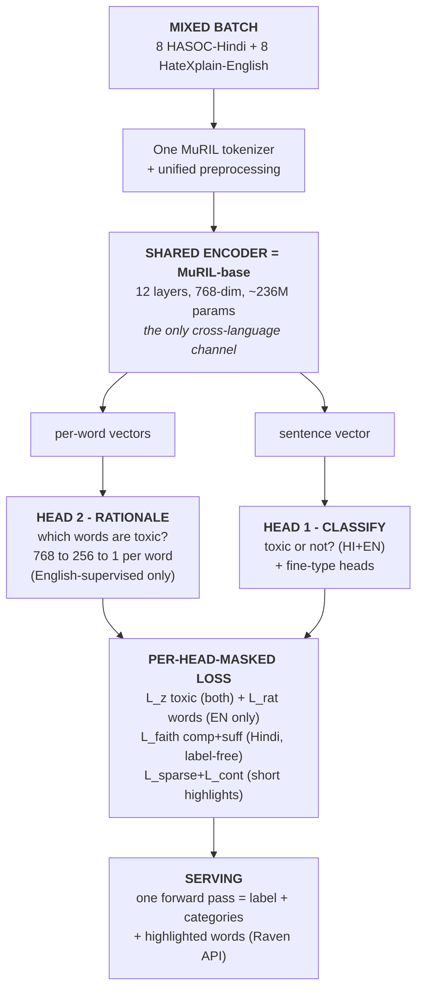

# RAVEN-X — Proposed Methodology

### Cross-Script Rationale Transfer for Hindi Hate Speech
*Learning faithful word-level explanations on Devanagari Hindi from English rationale supervision, with **zero** target-language rationale labels.*

**Author:** Niladri Hazra & team · **Supervisor:** Dr. Arpita Dutta · **Date:** 2026-06-07
**Builds on:** `RAVEN_IMPROVEMENT_REPORT.md` (gap analysis) · **Status:** proposed method, data verified, ready to build

> Every quantity here was measured on disk, not assumed. Where the original idea ("Hinglish / romanized code-mixed") contradicted the data, the method was changed to match the data.

---

## 0. The correction that shaped the method (verified on disk)

I measured `raven-codemixed/data/hasoc2019/hindi_dataset.tsv` (4,665 labeled rows) before designing anything:

| Script make-up of HASOC-2019 Hindi | Share |
|---|---|
| Devanagari-dominant posts (>80% Devanagari chars) | **74.9%** |
| Mixed (20–80% Devanagari) | 17.8% |
| Latin-dominant posts (<20% Devanagari) | **7.3%** |
| Devanagari share of all script characters | **82.5%** |

**Conclusion:** the corpus is **overwhelmingly native-script Hindi (Devanagari), not romanized Hinglish.** This matters enormously: a Devanagari slur and its English equivalent share **zero subword tokens** (disjoint Unicode → disjoint WordPiece IDs → disjoint embedding rows). So any cross-lingual transfer that happens is **purely representational** (through MuRIL's shared meaning space), which is *harder and more original* than the romanized story — and **examiner-proof**, because it matches the data instead of contradicting it. The ~7% Latin slice is kept and analyzed **separately** as the "easy case."

A second verified fact reshapes evaluation: the official HASOC gold test file (`hasoc2019_hi_test.tsv`) is **blind** — two columns, no labels. So we **freeze a stratified seed=42 split** (train 3,265 / val 699 / test 701) and re-run *every* baseline on it. We make **no leaderboard-comparability claim.**

---

## 1. Plain-language explanation (for the viva, no jargon)

You're building a tool that (a) says a post is *hateful* or *fine*, and (b) **underlines the exact words** that make it hateful — like a teacher marking a paper.

- Part (a) is easy: we have ~4,700 Hindi posts labelled hateful/not (HASOC-2019).
- Part (b) is the hard, valuable part. To *train* a model to underline, you need posts where humans already underlined the hateful words. Those exist **for English** (HateXplain, 20k posts with word-level marks) — but **nobody has ever underlined hateful words in Hindi.**

**The research question:** *Can a model learn to underline from English examples, then correctly underline Hindi words it was never shown marks for?* The only thing that makes this even possible is **MuRIL** — a multilingual model pretrained on both English and Hindi, so internally it represents a word's **meaning**, not its spelling. An English slur and a Devanagari slur look nothing alike on paper, but MuRIL may place them in nearby "meaning regions." If so, a small "underliner" trained on English meaning-regions might fire on Hindi slurs too.

**The honest catch (and the heart of the project):** English and Hindi use completely different alphabets, so there's no shared spelling to lean on. Whether transfer works is a question we **measure**, not assume — using a trick that needs no Hindi marks at all: *delete the words the model underlined and check if its "hateful" confidence collapses.* If it does, the underlining was real (**comprehensiveness**); if keeping only those words preserves the verdict, it was complete (**sufficiency**). These deletion tests give a faithfulness score on Hindi with **zero Hindi rationale labels.**

**Why it can't fail:** even if cross-script transfer turns out weak, a rigorous *"English→Devanagari rationale transfer does not survive the script boundary — here's the per-script evidence and why"* is itself a clean negative result the field lacks (and your supervisor's survey explicitly calls for).

---

## 2. Problem formulation

A post `x` is `W` whitespace words. One shared tokenizer `T` (MuRIL WordPiece, 197k vocab) maps it to `L ≤ 128` subwords with alignment `a: subword → word` (via `T.word_ids()`).

**Outputs per post:**
1. `ŷ ∈ {NOT, HOF}` — binary hate/offensive (HASOC Task-A, **primary**).
2. *(optional)* fine-grained type `{HATE, OFFN, PRFN, NONE}` and target `{TIN, UNT}` — HASOC-only secondary heads (HateXplain doesn't annotate these, so they get **no** cross-lingual benefit; we say so).
3. `r̂ ∈ [0,1]^W` — a **learned word-level rationale** (the explanation), served as `words:[{w,s}]` to match the existing Raven API contract.

**Two heterogeneous supervision sources (the crux — they never co-occur on one example, and differ in BOTH language AND script):**

| | Source B — classification | Source A — rationale |
|---|---|---|
| Corpus | HASOC-2019 Hindi | HateXplain |
| Provides | post label only, **no rationale** | 3-class label **+ token rationale mask** |
| Language / script | Hindi / **Devanagari** (75–90%) | English / Latin |
| `has_rationale` | 0 | 1 on toxic (11,413), 0 on normal (8,153, valid all-zero target) |

**Label-space reconciliation.** A is 3-class, B is binary. Both map to a **shared toxicity axis** `z`: `z=1` iff (hatespeech ∨ offensive) in A, iff HOF in B. The shared `z` head carries all cross-corpus signal; native heads (HASOC fine-type, HateXplain 3-class) stay per-corpus so each is reported in its own label space.

**Formal objective.** Learn shared encoder `θ_enc`, classification heads `θ_cls`, token-rationale head `θ_rat` minimizing a **per-head-masked** multi-task loss over `D_A ∪ D_B`, such that on the HASOC held-out test the classifier maximizes macro-F1, **and** the rationale head — supervised by token labels **only on English** — emits rationales on Devanagari Hindi whose **faithfulness is measured, script-stratified.** The defining constraint: `has_rationale=1 ⇒ lang=EN`. The scientific question is whether `r̂` is faithful on Devanagari where it has **zero** rationale supervision.

---

## 3. Architecture



*(If your viewer doesn't render Mermaid, the same architecture in plain text:)*

```text
  MIXED BATCH:  8 HASOC-Hindi  +  8 HateXplain-English
       |
       v   (one MuRIL tokenizer + unified preprocessing)
  [ SHARED ENCODER = MuRIL-base, ~236M params ]
       |    the ONLY cross-language channel
       |
       +--> per-word vectors --> HEAD 2: RATIONALE
       |        which words are toxic?  (768->256->1)
       |        supervised on ENGLISH only
       |
       +--> sentence vector  --> HEAD 1: CLASSIFY
       |        toxic or not?  (HI+EN, + fine-type)
       v
  PER-HEAD-MASKED LOSS
  (each loss term applies only where that label exists)
       L_z       toxic           both corpora
       L_rat     which-words      English only
       L_faith   comp + suff      Hindi (label-free)
       L_sparse + L_cont          short highlights
       |
       v
  SERVING:  one forward pass -> label + category scores
            + highlighted words   (served by the Raven API)
```

**Read it top-to-bottom:** each batch is half Hindi (gives toxic/not labels) + half English (gives word-level rationales) -> one shared MuRIL encoder -> two heads (classify + rationale) -> a masked loss that applies each signal *only where it exists* -> served as one fast forward pass.

---

## 4. The transfer mechanism — three legs (stated honestly for Latin→Devanagari)

We **delete** every "romanized slur shares subwords with English" claim — it's false here. Transfer, if it exists, is **purely representational**, and we treat its existence as a *measured hypothesis*, not a premise.

- **Leg 1 — Shared semantic space (hypothesis, gated Week 1).** MuRIL was pretrained jointly on Devanagari-Hindi and English, aligning *meanings* across scripts. The token head reads contextual states with **no** language/script-specific parameters; fitting it on English rationales learns a *direction* in encoder space for "this token drove the toxicity decision." **We prove or refute** that this direction projects onto Hindi via a Week-1 go/no-go probe: CKA between EN/HI abusive-token states + cross-script nearest-neighbour retrieval + an English-trained logistic probe tested on Hindi. *Pre-registered prediction: alignment is partial, weaker on Devanagari than on the Latin slice.*
- **Leg 2 — Joint gradient coupling (load-bearing).** The encoder is **not** frozen. Every batch is 50% Hindi + 50% English, so the same `θ_enc` gets Hindi classification gradient **and** English rationale gradient *in the same step*. Hindi post-label supervision implicitly **curates** the Hindi token geometry the rationale head reads — pulling toxic Hindi tokens toward the region the head (from English) rewards, **with no Hindi token label.**
- **Leg 3 — Label-free faithfulness self-training (the originality engine).** On Hindi we compute a faithfulness target from the classifier itself: comprehensiveness `C = p_HOF(x) − p_HOF(x \ R_k)` and sufficiency via `R_k`-only. **Critical correctness fix:** masking the hidden states and re-running only the pooler is *not* a faithful intervention (self-attention still attends to "masked" tokens). We mask at the **attention level** (`attention_mask=0` on selected tokens) and **re-run the full encoder**, with a **straight-through** estimator on a discrete top-k selection — so the training objective and the evaluation metric use the *same* intervention.

**Anti-circularity (the sharpest attack, answered):** (1) the English token-label anchor `L_rat` is in **every** batch, so a Hindi rationale that collapses immediately pays measurable English token-F1; (2) a hand-annotated **150–200-post Devanagari rationale set** (eval-only, never trained) gives one *non-circular* token-F1; (3) AOPC with **hard** removal at inference vs three controls (random-init head, shuffled-English-label head, slur-lexicon highlighter); (4) a gradient×input **upper bound**. The transfer claim holds only if RAVEN-X beats all controls with significance.

---

## 5. Loss functions

Masks `1[·]` gate every term so missing supervision contributes **exactly 0 gradient, never a wrong target.** Word score `r_w = AGG_{j:a_j=w} σ(a_j)` (mean by default).

```
(1) Shared toxicity (both corpora):
    L_z    = BCE(σ(z), z*),    z* = 1[hate∨offensive (A)] = 1[HOF (B)]

(2) Native heads (per-corpus masked):
    L_clsA = 1[lang=EN]·CE(softmax(y3), y^A)        # HateXplain 3-class
    L_clsB = 1[lang=HI]·CE(softmax(t4), t^B)        # HASOC fine-type

(3) Rationale (English-supervised token-BCE on first-subword logits; specials=-100;
    pos_weight≈4 for ~15% positive rate; normal posts give valid all-zero targets):
    L_rat  = 1[has_rationale]·Σ v_j·BCE(σ(a_j), r_sub_j) / max(Σ v_j, 1)

(4) Faithfulness (label-free, Hindi; hard top-k via straight-through; attention-level
    masking + FULL-encoder re-run — the honest intervention):
    R_k = top-k by σ(a_j)  (k = 20% of real tokens)
    L_comp = 1[HI]·p_HOF(encoder(x, attn with R_k zeroed))          # remove → toxicity drops
    L_suff = 1[HI]·(p_HOF(x) − p_HOF(encoder(x, attn with ¬R_k zeroed)))^2

(5) Priors (Lei et al. 2016 — anti-degenerate):
    L_sparse = λ_s·mean(σ(a)),   L_cont = λ_c·mean(|σ(a_i) − σ(a_{i-1})|)

TOTAL:
    L = L_z + α(L_clsA+L_clsB) + β·L_rat + γ(L_comp+L_suff) + L_sparse + L_cont
```

**Defaults (val-tuned, pre-registered):** α=0.5, β=2.0 (ablated {1,2,3}), γ ramped 0→0.5 over the first joint epoch (no faithfulness pressure until the head is warm), λ_s=0.02, λ_c=0.01, pos_weight=4, k=20%. *Why masking is the key detail:* an English example never receives a (nonexistent) Hindi fine-type gradient, and a Hindi example never receives a (nonexistent) rationale-label gradient — the formal rebuttal to *"you trained Hindi on rationale labels that don't exist."*

---

## 6. Training protocol

- **Mixing:** `ConcatDataset` + stratified batch sampler → each batch of 16 = **8 HASOC-HI + 8 HateXplain-EN**. HASOC (~3.3k) is oversampled ~4× vs HateXplain (~15.4k). The 50/50 split is the key transfer knob (Leg 2 only couples if both appear in the same step) and is itself ablated (50:50 vs 80:20).
- **Unified preprocessing (fixes a domain-leak):** re-join HateXplain `post_tokens`; map `@user→<user>`, numbers→`<number>`, urls→`<url>` on **both** corpora (reuse the existing API normalization); one tokenizer; `word_ids()` alignment with a **unit test** on hand-checked examples.
- **Optimizer:** AdamW, discriminative LR 2e-5 encoder / 1e-4 heads, 6% warmup, wd 0.01, grad-clip 1.0, fp16, max_len 128, effective batch 32 (bs16 × accum2).
- **Schedule (anti-collapse):** Stage 0 (1 epoch) — freeze encoder, train heads only (γ=0); Stage 1 (3–4 epochs) — unfreeze, full loss with γ ramp. Early-stop on a **composite** dev metric = mean(HASOC macro-F1, HateXplain token-F1, Hindi AOPC-comprehensiveness) so we never trade away the contribution.
- **Seeds:** 3 {13,42,123} for the main table; 5 for the two headline rows (RAVEN-X vs MuRIL-classification-only).
- **Hardware:** single free Kaggle/Colab **T4**. Vanilla classifier ~8–11 min/epoch; the triple-forward faithfulness step ~2–2.5× → RAVEN-X ~20–25 min/epoch (~1.5–2 h/seed). Whole study fits Kaggle's 30 GPU-h/week across 3–4 sessions.

---

## 7. Evaluation protocol (built so the viva can't crack it)

- **Split:** frozen stratified 70/15/15 (seed=42), split-index file checked in, malformed row cleaned. **No leaderboard claim**; off-the-shelf CNERG/L3Cube are reported as inference-on-our-test, not their gold-test numbers.
- **Classification baselines (identical split):** B1 MuRIL-classification-only (the non-inferiority anchor), B2 XLM-R, B3 IndicBERT, B4 CNERG hindi-codemixed-abusive-MuRIL, B5 L3Cube hate-roberta-hasoc-hindi, B6 TF-IDF+LogReg. **The English DistilBERT 0.885 never appears as a row** — different language/task/dataset, a category error, stated explicitly.
- **Explanation baselines (same fine-tuned MuRIL, so the explainer is the only variable):** E1 the shipped occlusion explainer (the incumbent to beat), E2 attention, E3 Integrated Gradients, E4 gradient×input (upper bound), E5 slur-lexicon, E6 random (floor).
- **Metrics:** classification macro-F1 (primary, mean±std); rationale faithfulness on Hindi = **comprehensiveness / sufficiency / AOPC** at k∈{1,5,10,20,50}% with hard removal. **⭐ Script-stratified faithfulness is the headline, not the pooled average** — reported separately on Devanagari / Latin / mixed, so a Devanagari failure can't hide behind the easy Latin slice. English plausibility = token-F1/IOU/AUPRC on HateXplain gold (proves the head learned real rationales first). **Non-circular Hindi check** = token-F1 on the 200-post hand-annotated Devanagari set.
- **Transliteration arm:** transliterate Devanagari test posts to Latin (IndicXlit) and re-measure — directly tests whether the English-fit direction transfers better onto Romanized surface forms.
- **Statistics:** paired bootstrap (10k) for macro-F1 deltas; paired Wilcoxon across seeds for AOPC; Holm-Bonferroni across the family. **Pre-registered endpoints:** (1) RAVEN-X macro-F1 non-inferior to B1 (margin 1.0 F1); (2) RAVEN-X AOPC-comprehensiveness > E1 occlusion **on the Devanagari slice**, beating all three controls with significance.
- **Fairness:** HASOC has no identity columns (only TIN/UNT, verified) → per-target-type FPR on HASOC + HateXplain community subgroup-AUC on the English side + a small *curated* Hindi identity-term lexicon slice (stated as approximate). Does the rationale head over-fire on identity terms?

---

## 8. Six-week plan (each week has a verify gate)

| Wk | Focus | Verify gate |
|:-:|---|---|
| 1 | Data plumbing + **3 go/no-go gates** | Alignment unit test passes; frozen split checked in; **Gate A** geometry probe (CKA/NN/probe) — if near-zero even on Latin, pivot headline to Leg-3 + honest negative *now*; **Gate B** pilot-annotate 30 Devanagari rationales |
| 2 | Classification benchmark (Tier-1, un-failable) | Full macro-F1 table (B1–B6, 3 seeds, mean±std) + bootstrap on the frozen split |
| 3 | RAVEN-X core + faithfulness machinery | Gradient-norm unit test proves grad flows through σ(a_j); HateXplain token-F1 proves the head learned real rationales; degenerate-rate monitored |
| 4 | Transfer evaluation + the honest result | Script-stratified AOPC vs E1–E6; 200-post non-circular token-F1; controls; decisive ablations; non-inferiority vs B1 |
| 5 | Serving (real integration, not a flag) | New `AutoModel + RavenXHeads` load path + `explain_one_learned`; end-to-end demo through web/extension; occlusion kept as fallback |
| 6 | Write-up + reproducibility + model card | Fresh clone reproduces headline number; model card ships **weights + split indices only**, never raw data |

---

## 9. Defensible novelty (no overclaim)

The contribution is the **specific conjunction** on this task/script-pair: **cross-script + rationale-level + faithfulness-trained + zero target-language rationale labels**, on Devanagari Hindi hate speech, with script-stratified measurement that makes the claim *falsifiable*. Distinct from:
- **HateXplain** — supervises & evaluates rationales only in English, same script, no transfer.
- **CNERG / L3Cube** — classify Hindi but emit no explanation.
- **Raven's occlusion explainer** — post-hoc, untrained, O(n) forwards, faithful only by assumption; ours is learned, single-forward, faithfulness-optimized, and *empirically* tested to beat it.
- **XLM-R zero-shot NER** — within-script or surface-overlap transfer; ours is the first **rationale** transfer across a script boundary with zero lexical overlap.

We do **not** claim to invent cross-lingual transfer, faithfulness-regularized rationales (Lei et al.), or ERASER faithfulness (DeYoung et al.) — all cited. And per your survey, a **rigorously reported negative** ("English rationale supervision does not transfer faithfully to Devanagari — here is the per-script AOPC and the geometry probe explaining why") is itself a contribution the field lacks. **That is what makes the project un-failable: succeeding and failing both produce a publishable, examiner-proof result.**

---

## 10. Honest limitations (have these ready)

1. **Central risk:** cross-script transfer may largely fail on the Devanagari mass (zero subword overlap). *Mitigation, not denial:* Week-1 geometry gate quantifies it first; results are script-stratified; a rigorous negative is pre-registered as valid.
2. **No target-language rationale gold** beyond a tiny self-made set; faithfulness measures faithfulness-*to-the-model*, not correctness.
3. **Circularity** of the faithfulness objective — defended (English anchor, controls, hard-removal eval, non-circular 200-post set) but stated explicitly, not hidden.
4. **No leaderboard comparability** (blind gold test → frozen carve-out).
5. **Small corpus / multi-task drift** — the "no accuracy cost" claim is an *empirical* outcome gated on the non-inferiority test, not an assumption.
6. **Serving is real integration work** (new load path + `explain_one_learned`), not an env flip.
7. **Fairness is approximate** on Hindi (no identity columns).
8. **Generalization is N=1** — one dataset, one backbone family; demonstrated for this corpus/script-pair only.

---

## 11. What to say to Dr. Dutta

> *Ma'am — your survey flags two gaps the field dodges: explainability that works on non-English low-resource text, and honest reproducible negative results. RAVEN-X attacks both. I opened our HASOC-2019 Hindi files first: the corpus is ~75–90% Devanagari (82.5% Devanagari characters), **not** romanized Hinglish, and the gold test is blind. So I'm not pitching Hinglish transfer (which the data would falsify in one grep). I'm pitching the harder problem: can word-level hate-rationale supervision learned only on English-Latin HateXplain transfer **across a script boundary** to Devanagari Hindi, where there's zero subword overlap and no Hindi rationale labels? Any transfer is purely representational through MuRIL's shared meaning space — and nobody has measured rationale faithfulness across a Latin→Devanagari boundary before. One shared MuRIL encoder, a classification head, a small rationale head, a per-head-masked loss so we never fake a missing label, and a label-free faithfulness self-objective. I measure it three ways: English token-F1 (the head learned real rationales), script-stratified AOPC on Hindi (the headline, reported separately so failure can't hide), and a CKA geometry probe (why transfer does or doesn't happen). It runs on a free T4 in 4–6 weeks, ships into our existing Raven product as a faster learned explainer, and Tier-1 (an honest reproducible Hindi benchmark) is a complete contribution even if the transfer turns out weak.*
